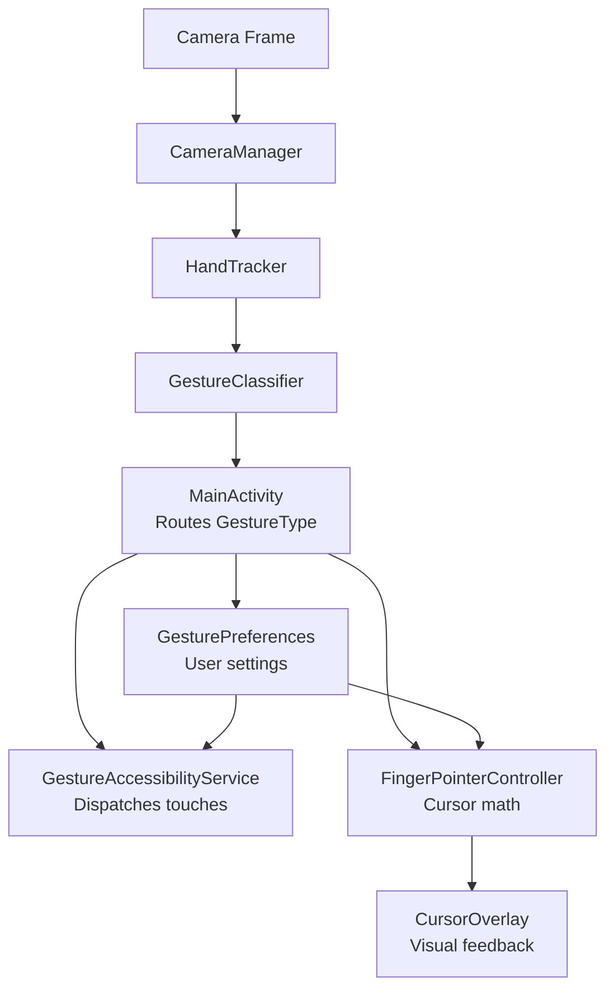

# Walkthrough: Gesture Control Android v2.0 Refactor

## Summary

Refactored a **2-file monolith** (723 lines total) into a **clean 11-file modular architecture** (~70K bytes) with a mobile-first gesture set, Finger Mouse virtual pointer, animated cursor overlay, and user-configurable settings panel.

---

## Architecture (Before → After)

### Before (v1.0)
```
MainActivity.kt (412 lines) — camera + MediaPipe + gesture state machine + UI
GestureScrollService.kt (311 lines) — scroll + tap + click + drag + zoom + cursor
```

### After (v2.0)


---

## What Was Removed ❌

| Feature | Reason |
|---------|--------|
| `tap()` / Left Click | Android has native tap — redundant |
| `longPressAt()` called "Right Click" | PC naming; replaced with proper `longPress()` |
| `startDrag/updateDrag/endDrag` | PC drag-and-drop — not useful on mobile |
| All drag state tracking | No longer needed without drag |
| Deprecated `defaultDisplay.getMetrics()` | Replaced with `WindowMetrics` API |

---

## What Was Added ✅

| Feature | File | Description |
|---------|------|-------------|
| **Finger Mouse Controller** | [FingerPointerController.kt](file:///c:/Users/dell/Desktop/New%20folder%20(2)/GestureScrollAndroid_Enhanced/GestureScrollAndroid_Enhanced/app/src/main/java/com/example/gesturescroll/pointer/FingerPointerController.kt) | Full pointer pipeline: dead zone, velocity acceleration, EMA smoothing |
| **Animated Cursor** | [CursorOverlay.kt](file:///c:/Users/dell/Desktop/New%20folder%20(2)/GestureScrollAndroid_Enhanced/GestureScrollAndroid_Enhanced/app/src/main/java/com/example/gesturescroll/pointer/CursorOverlay.kt) | Pulsing ring + dot with color states (idle/active/longpress) |
| **Settings Panel** | [SettingsActivity.kt](file:///c:/Users/dell/Desktop/New%20folder%20(2)/GestureScrollAndroid_Enhanced/GestureScrollAndroid_Enhanced/app/src/main/java/com/example/gesturescroll/settings/SettingsActivity.kt) | Sliders for sensitivity, smoothing, dead zone, scroll speed + toggles |
| **Gesture Classifier** | [GestureClassifier.kt](file:///c:/Users/dell/Desktop/New%20folder%20(2)/GestureScrollAndroid_Enhanced/GestureScrollAndroid_Enhanced/app/src/main/java/com/example/gesturescroll/detection/GestureClassifier.kt) | Pure logic, unit-testable, no Android deps |
| **GestureType sealed class** | [GestureType.kt](file:///c:/Users/dell/Desktop/New%20folder%20(2)/GestureScrollAndroid_Enhanced/GestureScrollAndroid_Enhanced/app/src/main/java/com/example/gesturescroll/detection/GestureType.kt) | Type-safe gesture representation |
| **Non-deprecated screen utils** | [ScreenUtils.kt](file:///c:/Users/dell/Desktop/New%20folder%20(2)/GestureScrollAndroid_Enhanced/GestureScrollAndroid_Enhanced/app/src/main/java/com/example/gesturescroll/util/ScreenUtils.kt) | WindowMetrics (API 30+) with fallback |
| **Dark theme** | [themes.xml](file:///c:/Users/dell/Desktop/New%20folder%20(2)/GestureScrollAndroid_Enhanced/GestureScrollAndroid_Enhanced/app/src/main/res/values/themes.xml), [colors.xml](file:///c:/Users/dell/Desktop/New%20folder%20(2)/GestureScrollAndroid_Enhanced/GestureScrollAndroid_Enhanced/app/src/main/res/values/colors.xml) | Indigo-purple + mint green palette |
| **Long press hold requirement** | GestureClassifier | Must hold thumb+middle pinch for 500ms — prevents false triggers |
| **Rate limiting in service** | GestureAccessibilityService | Scroll/zoom/longpress all rate-limited to prevent spam |

---

## Key Design Decisions

### 1. Pure GestureClassifier
The classification logic has **zero Android framework dependencies**. It takes landmarks + timestamp and returns a `GestureType`. This means you can unit test it without Robolectric or instrumented tests.

### 2. Finger Mouse Pipeline
```
Raw Landmark → Mirror X → Dead Zone Filter → Velocity Acceleration → Sensitivity × → EMA Smoothing → Screen Clamp
```
Each step serves a specific purpose:
- **Mirror**: Front camera is mirrored; flipping X makes it feel natural
- **Dead zone**: Single most effective anti-jitter measure
- **Velocity acceleration**: Slow = precise, fast = covers distance (like a real mouse)
- **EMA**: Smooths the final output without losing responsiveness
- **Clamp**: Prevents cursor from going off-screen

### 3. Cursor Color States
The cursor dot changes color to provide immediate visual feedback:
- 🟣 **Purple** — idle/default
- 🟢 **Green** — finger pointer active (tracking)
- 🔴 **Red** — long press triggered

### 4. Long Press = 500ms Hold
Unlike the original which fired "right click" immediately on thumb+middle pinch, the new long press requires a **500ms sustained pinch**. This prevents false triggers during other hand movements.

---

## File Responsibility Matrix

| File | Lines | Responsibility |
|------|-------|----------------|
| `MainActivity.kt` | ~220 | Permission, wiring, UI updates, routing |
| `CameraManager.kt` | ~95 | CameraX setup, frame delivery |
| `HandTracker.kt` | ~105 | MediaPipe init, detection, cleanup |
| `GestureClassifier.kt` | ~160 | Landmark → GestureType classification |
| `GestureType.kt` | ~55 | Type definitions |
| `FingerPointerController.kt` | ~130 | Cursor smoothing & mapping |
| `CursorOverlay.kt` | ~155 | Visual cursor drawing |
| `GestureAccessibilityService.kt` | ~190 | Touch dispatch |
| `GesturePreferences.kt` | ~100 | SharedPreferences wrapper |
| `SettingsActivity.kt` | ~170 | Settings UI logic |
| `ScreenUtils.kt` | ~50 | Screen metrics helper |

---

## How to Test

1. **Build**: Open in Android Studio → Sync Gradle → Build
2. **Install**: Deploy to device/emulator with front camera
3. **Enable service**: Settings → Accessibility → Gesture Control → ON
4. **Test gestures**:
   - ☝️ Index finger → cursor should track smoothly
   - ✊ Fist → should toggle pause/resume
   - ☝✌ Index + Middle → scroll up in any app
   - 🖕 Middle up, index down → scroll down
   - ✌️ Spread/close fingers → zoom in/out in Maps or Gallery
   - 🤙 Thumb + Middle hold → long press (opens context menu)
5. **Test settings**: Adjust sensitivity slider → cursor should respond faster/slower
6. **Test toggles**: Disable Finger Mouse → cursor overlay should disappear
